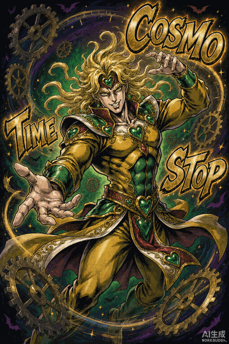

<div align="center">

</div>

<div align="center">

[](https://github.com/Terrencesliang)
[](https://github.com/Terrencesliang)
[](https://github.com/Terrencesliang)


</div>

<!-- ================================================================
     ↓↓↓ 以下为 JoJo 追加层，原内容上方未做任何改动 ↓↓↓
================================================================ -->

<div align="center">


<!-- JoJo 立绘（把 assets/ 文件夹一起推到仓库即可显示）-->


**「やれやれだぜ」** *— yare yare daze...*

</div>

<!-- ==================== TERMINAL ==================== -->

```bash
$ whoami
> Terrence · AI Engineer / Founder

$ ./summon_stand.sh
> Stand Name  : 「AI PLATINUM」
> User        : Terrencesliang
> Ability     : Building AI-Powered Systems · Turning Ideas into Reality
> Destructive : A   Speed : A   Precision : A   Potential : ∞
> Status      : MANIFESTED ✓

$ echo $STAND_CRY
> ORA ORA ORA ORA ORA ORA!!
```

<div align="center">


</div>

---

### ⚔️ Stand Stats

```bash
$ cat /etc/stand.conf
```

| Ability | Rank | Detail |
| :--- | :---: | :--- |
| 🧠 AI Systems | A | LLM · Agents · RAG · Automation |
| 🚀 Founder | A | 0 → 1 · Product · Team |
| 💡 Ideation | A | Turning ideas into reality |
| 🤝 Collaboration | A | Open to innovate together |

---

### 📊 Observer Report

<div align="center">

<a href="https://github.com/Terrencesliang">
  
</a>
<a href="https://github.com/Terrencesliang">
  
</a>

<br/>


</div>

---

### 📫 Contact — 「次に会う時が、本番だ」

<div align="center">

<!-- DIO 登场 -->


**「人間は限界を超えた時、替身（AI）を手にする」**

**ROAD ROLLER DA !!!!**


</div>
