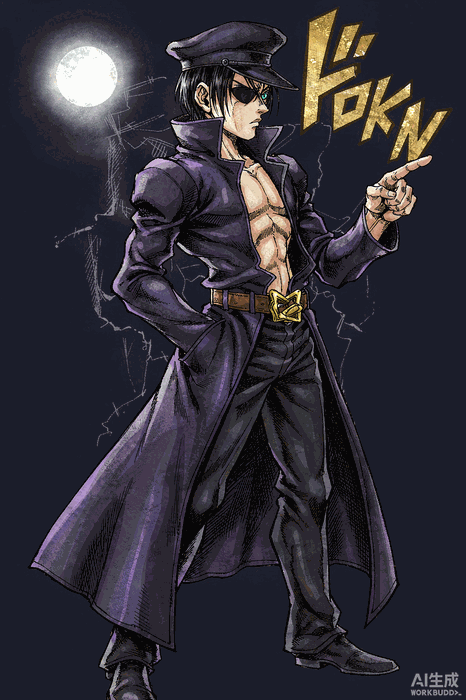

<div align="center">

</div>

<div align="center">

[](https://github.com/Terrencesliang)
[](https://github.com/Terrencesliang)
[](https://github.com/Terrencesliang)


</div>

<div align="center">



</div>

```bash
$ ./summon_stand.sh
> Stand Name  : 「STAR PLATINUM」
> User        : Terrence — AI Engineer / Founder
> Ability     : Building AI-Powered Systems · Turning Ideas into Reality
> Stats       : 破坏力 A · 速度 A · 射程 C · 精密度 A · 成长性 A
> Status      : MANIFESTED ✓
「このマシンは仲良くさせてもらうぞ…よろしくな」

★ terrence@starplatinum:~$
```
